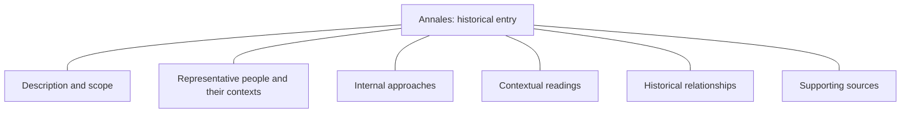
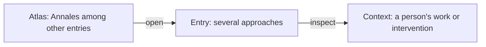
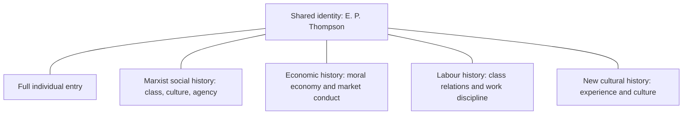
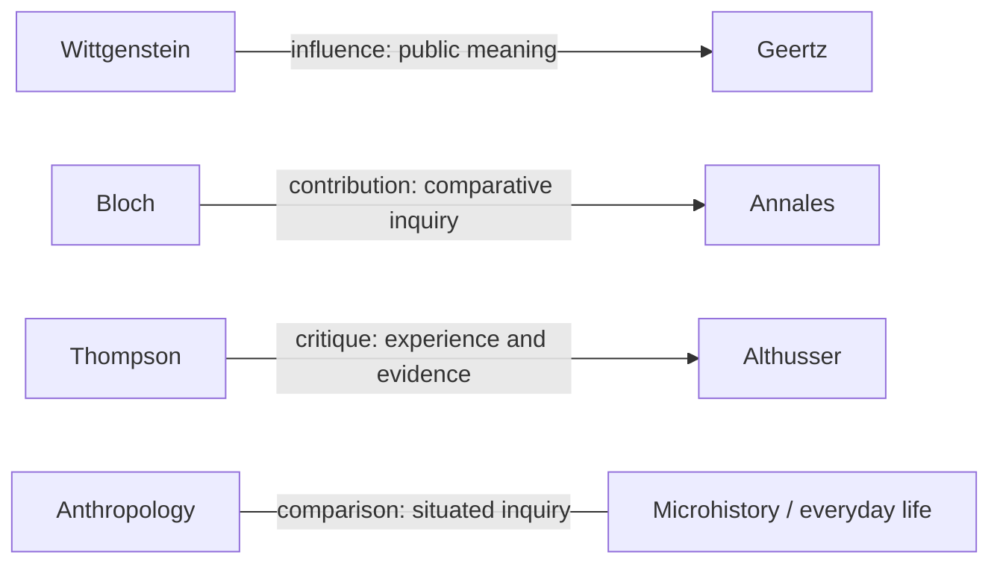
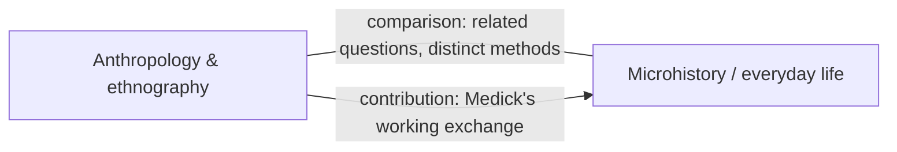
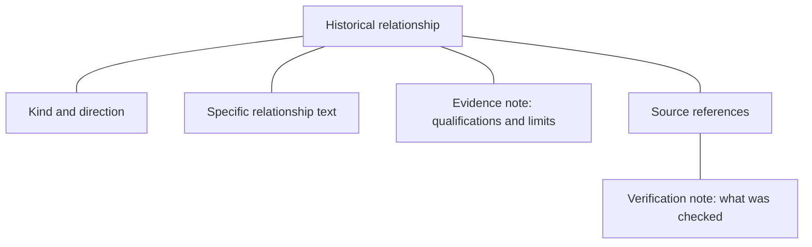
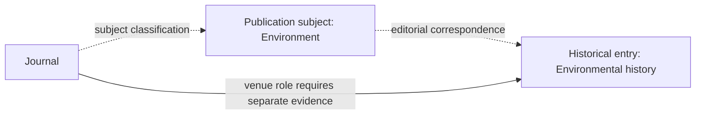
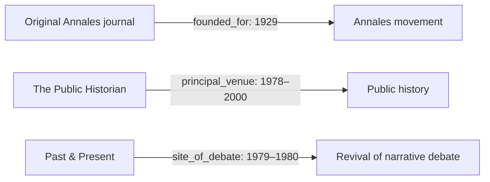
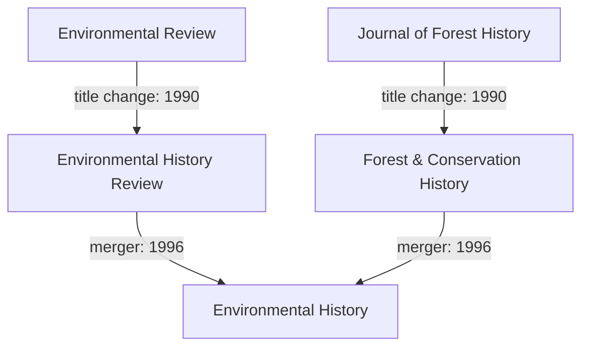
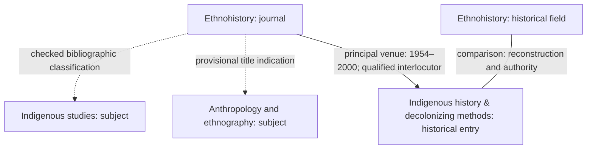

# Reading the historiography and journals ontology

Recorded 2026-09-17 at the user's request, from the conversational walkthrough. This guide describes editorial revision **1.118**, historical schema **1.4**, and journal schema **1.3**. Counts are dated observations, not permanent schema requirements. [GRAPH-FORMAT.md](GRAPH-FORMAT.md) is the format reference. The separate [entry-kind proposal](ONTOLOGY-PROPOSAL.md) is **not implemented**.

The atlas organizes historiographical arguments, practices, people, and institutions. Ask four questions: What approaches exist? Who contributes to or challenges them? Where do they acquire publishing communities? What evidence supports each connection?

Historical coverage is **1920–2000, with earlier roots**. Later bibliographic discoveries and retrospective sources do not extend substantive historical coverage.

## 1. Begin with an entry: a dossier with a qualified boundary

Opening **Annales** opens an editorial dossier on a school or movement. Its description, scope note, people, approaches, readings, relationships, and sources belong together without asserting a single doctrine.

These lines describe a dossier's contents; they are not influence claims. Annales's scope distinguishes its founding programme, Braudel's historical times, serial economic history, and later methodological reconsideration. A shared entry can contain disagreement and change.

The **Microhistory / everyday life** entry makes the editorial nature of boundaries especially clear. Italian microstoria, German Alltagsgeschichte, and Mexican microhistoria retain distinct histories. Proximity and shared terminology do not establish a common origin.

| Current `entry_type` | Examples | What is being examined |
| --- | --- | --- |
| Research field | Economic history; Labour history; Ethnohistory | A sustained area of inquiry |
| School or movement | Annales; Subaltern Studies; History Workshop | A historically situated intellectual or collaborative formation |
| Intellectual tradition | Historical materialism; Freudian psychoanalysis | Concepts and arguments with a longer history |
| Method or approach | Oral history; Quantitative history; Conceptual history | Ways of producing or interpreting historical knowledge |
| Teaching umbrella | Microhistory / everyday life; World / global / connected history | Related projects whose differences matter |
| Genre | Biography / life writing | A form of historical writing |
| Debate | Revival of narrative / debate over quantification | An organized disagreement |
| Individual thinker or historian | Marc Bloch; E. P. Thompson; Michel Foucault | A person with a full historical entry |

Schema 1.4 also has `entry_kind: group | person`. **Group is a legacy browsing bucket**, including fields, methods, genres, and debates. It does not establish collective agency or membership. The proposal to repair this is separate from the current format.

These categories are editorial descriptions. A method can also have communities and institutions; the category does not exhaust its history. Layers, period groups, and seminar pathways are further teaching arrangements, not ontological parent classes.

## 2. Increase magnification: internal approaches

`strands` expose distinctions within an entry without creating additional map nodes. Annales includes:

| Strand | Associated people | Distinction |
| --- | --- | --- |
| Founding exchange and historical problems | Bloch, Febvre | Initial collaborative programme |
| Braudel's multiple historical times | Braudel, Chartier | Temporal scales and their interpretation |
| Economic series and agrarian cycles | Labrousse, Le Roy Ladurie | Serial evidence and economic patterns |
| Belief, imagined order and representations | Le Goff, Duby, Chartier | Cultural questions within changing programmes |
| Models and the critical turn | Lepetit | Methodological reconsideration |
| Women's history and collaborative limits | Duby, Perrot | Qualified collaboration |

Chartier can appear in several strands. This is an editorial grouping, not exclusive membership or inferred community detection. A strand's ID is local to its parent: Annales's `duration` is not a global node ID. Strands do not generate historical edges.

These arrows describe reading. At revision 1.118, 73 non-person entries contain 731 approaches.

## 3. Separate identity, contextual role, and individual entry

The shared `people` collection answers **which person**. A `representative_people` selection answers **why this person matters here**. An optional individual node provides a fuller map entry.

These are identity references and selections, not influence arrows. Thompson's economic-history context emphasizes crowd protest, customary norms, and market legitimacy through the moral-economy essay. His labour-history context selects class relations and work discipline. Each selection retains its own works, sources, and qualification.

Selection roles are `historian`, `contributor`, `precursor`, `critic`, or `comparison`. These describe the particular context, not an exclusive profession or affiliation.

In Microhistory / everyday life, **Hans-Ulrich Wehler is a critic** of Alltagsgeschichte. **Siegfried Kracauer is a comparison** concerning historical scale; the context explicitly avoids claiming influence on microhistory's emergence. A roster search therefore does not produce an adherents list.

There are 829 shared identities but only 43 individual map entries. The choice to give someone a full node is editorial, not an importance score. A selection can reference an existing historical edge through `edge_id`, but roster inclusion itself creates no edge.

Works remain contextual reading strings, not a normalized work/edition database. A reading chosen in one context should not silently replace a different reading chosen elsewhere.

## 4. Read historical relationships as qualified sentences

| Kind | Question | Actual example |
| --- | --- | --- |
| `influence` | What intellectual resource was taken up? | Wittgenstein → Geertz |
| `contribution` | What intervention or resource contributes here? | Bloch → Annales |
| `critique` | Who challenges which position? | E. P. Thompson → Althusser |
| `comparison` | What is useful to examine together? | Anthropology — Microhistory / everyday life |

The Wittgenstein relationship concerns a bounded borrowing, not Geertz's entire project. Bloch's contribution text specifically includes co-founding and methodological contributions; co-founding is not implied by every `contribution` edge. The Thompson arrow records a polemic without adjudicating its outcome. The comparison has no direction even though the stored record has `source` and `target` fields.

Two relationships can legitimately share endpoints. `edge_041` compares anthropology and microhistory broadly; `edge_369` records Medick's specific documented working exchange, qualified to historical anthropology and everyday-life research within the umbrella.

A path does not establish a further relationship: A influencing B and B contributing to C does not automatically prove A influenced C. Paths suggest historical questions. All 752 current edges have explicit classifications; older records with missing metadata must remain unclassified rather than being treated as influences or comparisons.

## 5. An edge is a small argument with references

The historical claim and the work done to check it are separate. In the Wittgenstein–Geertz case, the edge identifies a borrowing concerning public meaning; the source record specifies which portions of Geertz were read and which were not.

| Source status | Scope |
| --- | --- |
| `not_checked` | Proposed reference or URL not checked |
| `bibliographic_metadata_checked` | Identity or edition information checked |
| `supporting_page_checked` | Relevant page or extract consulted for the described support |
| Missing verification | Checking history unrecorded |

None means that an entire book or every associated claim was verified. A null URL can accompany a usable citation. Some source records group works; edition, translation, authorship, and citation networks are not fully normalized. Structural validation checks consistency, not historical truth.

## 6. Add publication venues and bibliographic identities

The journal extension recognizes periodical/title records, publication subjects, venue relationships, title relationships, discovery resources, and its own source namespace.

`publication_role` distinguishes `periodical_candidate`, `research_journal`, and `primary_source_periodical`. Ling Long, for example, can be historical evidence itself. CNKI belongs among discovery resources rather than being fabricated as a journal.

The 1,638 periodical/title candidates are not an authority-deduplicated census of currently active scholarly journals. **Labor History** and **Labour History** retain different identities and identifiers. Similar names alone do not justify merging. Original occurrences, aliases, script, and unresolved identities are preserved.

### Classification and historical role answer different questions

A subject classification records indexing, remit, or a provisional title indication. A venue relationship records a particular historical role in an atlas entry over a stated time.

The dotted path does not establish the solid connection. Some subject nodes have `atlas_node_ids` for navigation; many have none. Correspondence is not intellectual affiliation.

Classification bases include directory placement, library guides, publisher scope, bibliographic subject indexing, and `title_indicated`. The last must be provisional. A checked directory placement establishes that indexing was checked, not complete publisher remit throughout history. Current remit cannot be projected automatically across historical title phases.

### Three venue relationships bridge the graphs

- `founded_for` requires a constitutive role in the named field or school. A topical launch statement alone is insufficient. The original Annales journal's 1929 founding programme does not encompass every later Annales approach.
- `principal_venue` requires a sustained role, interval, and explicit selection rationale. The Public Historian selection qualifies its US professional-community role. Social History of Medicine's 1988–2000 role does not date the origin of medical history. Principal is not a prestige ranking or exclusive primacy claim.
- `site_of_debate` requires a named exchange and identifiable published contributions. Past & Present hosted Stone's 1979 essay and Hobsbawm's 1980 response without thereby endorsing either side. A named debate can be represented within a broader field or school entry.

All point journal → historical entry. Their direction does not assert uniform intellectual causation. A journal can have both founding and sustained-venue claims. Sources resolve in `journal_catalogue.sources`, not the historical source array. There is no generic `publishes` edge.

## 7. Publication identity changes through time

These are bibliographic transitions, separate from venue roles. Environmental Review, Environmental History Review, and Environmental History have principal intervals 1976–1989, 1990–1995, and 1996–2000 respectively. The accepted constitutive event concerns Environmental Review in 1976; the earlier Environment and History founding claim was withdrawn.

Annales has several distinct title phases, including wartime transitions. ESC and HSS share an ISSN while remaining separate named phases. Generic unresolved candidates are not silently merged. Some transition facts are recorded in title relationships without being duplicated into older canonical date fields; a null canonical date does not erase separately recorded evidence.

## 8. Always ask what a date dates

| Date | Meaning |
| --- | --- |
| Historical milestone | Selected event or work in an entry's history |
| Coverage through 2000 | Boundary of this historical account |
| Founding event | Specific journal event and constitutive claim |
| Catalogued title start | Library observation about the matched title/edition |
| Title-change year | Bibliographic transition |
| Venue-role interval | Evidenced selection interval |
| Archive coverage | Repository holdings |
| Check date | When research was performed |

Quaderni Storici's 1976–1987 principal interval does not establish its cessation or the end of microhistory. A repository's last available year does not establish cessation. Unknown journal ends remain unknown; `open_end: null` does not mean ongoing. Historical periods and seminar-pathway order do not create lifespans or genealogies.

## 9. Combine the distinctions: Ethnohistory

These are five different objects. The classifications support discovery. The journal's venue relationship is qualified: publication about Indigenous peoples does not establish Indigenous control of research or endorsement of decolonizing methods. The historical comparison preserves distinct questions about reconstruction and authority.

There is no accepted journal → new Ethnohistory-field venue edge in revision 1.118. Adding the field did not automatically redirect or duplicate the older claim. A plausible additional target still requires its own review.

## 10. Coverage, revision, and practical reading

| Component at revision 1.118 | Count |
| --- | ---: |
| Historical entries | 116: 73 non-person and 43 individual |
| Shared people / contextual selections | 829 / 1,309 |
| Internal approaches | 731 |
| Historical relationships | 752: 62 influence, 471 contribution, 121 critique, 98 comparison |
| Historical sources | 833 |
| Periodical/title candidates / publication subjects | 1,638 / 140 |
| Active subject classifications | 2,006: 1,322 checked, 684 provisional |
| Venue relationships | 54: 42 principal, 9 founding, 3 debate |
| Title relationships | 11 |

Venue relationships reach 32 of 73 non-person entries. An absent edge means no accepted relationship is recorded here, not that a field lacked journals. Counts reflect editorial coverage, not prestige or exhaustive global representation.

Replaced provisional classifications become inactive but remain recoverable. Withdrawn claims survive in historical batches and snapshots. Research leads and staged observations are distinct from accepted relationships; hashes and preservation audits protect the accepted record.

**Correction to the original conversational walkthrough:** current `site/field.mjs` already projects journals with accepted venue edges into the visualization, and `scripts/build_site.py` publishes a reduced journal catalogue. The earlier statement that journals had no renderer relied on stale handoff text. The repository data is the complete research catalogue; the published subset omits subject classifications, review history, and unlinked candidates. This guide documents ontology rather than certifying frontend fidelity or deployment status.

To practise, open Annales's scope and strands, locate Bloch's contextual selection, follow his identity to his individual entry, inspect his contribution edge, then inspect the original journal's founding and principal-venue relationships. Follow the title phases and read the sources' checking notes. Each step answers a different question while preserving the others.
