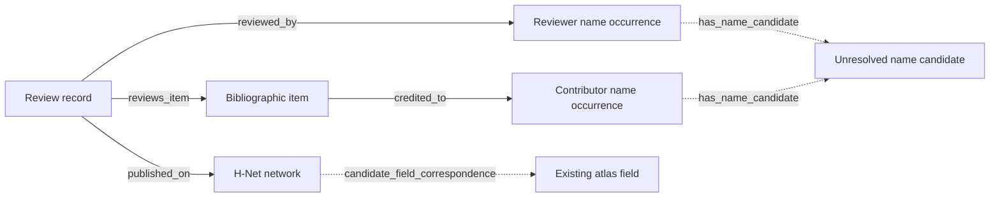

# H-Net bibliographic participation graph

User direction, 19 September 2026: build the basic graph of books, contributors,
reviewers and field contexts. Defer interpretation of review arguments and all
other substantive analyses. A reviewer's judgment is not a field's judgment.

The graph is generated locally from `/home/jic823/hnet-reviews/data`. It is
separate from the teaching graph at revision 1.123 and is not a website asset.
The external corpus is read-only input. The old DuckDB/Parquet export is not used.

## Available graph

`generated/graph.sqlite` is the queryable graph. `generated/nodes.jsonl` and
`generated/edges.jsonl` are portable node and directed-edge exports, one object
per line. `generated/summary.json` records counts, validation, source/input
fingerprints and output hashes. These large reproducible files are ignored by
Git; the builder, decisions, tests, and dated build report are tracked.



Solid connections record bibliographic metadata. Dashed connections are
explicitly provisional. Name-candidate nodes can contain homonyms and are
**not people**. Network-to-field candidates are navigational suggestions, not
classification of every publication in a network. Networks without atlas
mappings remain useful field contexts in their own right. For example,
H-Disability and H-Borderlands do not require premature atlas field creation.

## Rebuild, validate and search

```bash
python3 scripts/build_hnet_graph.py
python3 scripts/build_hnet_graph.py --check
python3 -m unittest tests.test_hnet_graph
python3 scripts/query_hnet_graph.py summary
python3 scripts/query_hnet_graph.py person 'Roy Rosenzweig'
python3 scripts/query_hnet_graph.py network H-Disability --limit 10
python3 scripts/query_hnet_graph.py book 'Digital History'
python3 scripts/query_hnet_graph.py review 43146
```

The builder reads one source at a time, uses a 16 MiB SQLite page cache, and
exports incrementally. It requires only the Python standard library and does
not launch a browser, contact APIs or resume OpenAlex. Build failures leave the
preceding generated output intact; final output hashes detect an interrupted
replacement. Never serve the repository root or add this directory to the
public site's explicit asset allowlist.

The source directory is being updated independently. Each build records the
enumerated file set, per-record hashes, and counts of files added, removed or
changed during the run. A build is a recorded snapshot, not a claim that a live
source directory has stopped growing. `sources.csv` exports its provenance inventory.

The SQLite `nodes` and `edges` tables contain the full graph. Structured tables
`sources`, `reviews`, `items`, `mentions`, `atlas_matches`, and `issues` support
queries without loading JSON exports. Convenience views `item_networks`,
`mention_networks`, `name_candidates`, and `duplicate_review_candidates` expose
traversal paths and reconciliation candidates. Source records retain local
relative paths, SHA-256 hashes, original URLs, archive URLs and capture dates.
Each bibliographic edge points to its source and records its metadata locator.

## Person disambiguation

1. Every parsed credit receives a stable **occurrence ID**, including the source
   review, item, credit locator, position, exact name and role. Reviewer affiliation
   is retained as source metadata. Two same-named reviewers remain separate
   occurrences even if their affiliations are identical.
2. An exact name index normalizes Unicode composition, case and whitespace.
   It preserves accents, initials, punctuation and name order. Shared keys
   create candidate groups only. No initials expansion, fuzzy match, surname
   inversion, transliteration or name-only person merge occurs.
3. `identity-candidates.csv` lists candidate groups, occurrence/review counts,
   distinct affiliation counts and affiliation strings. Multiple affiliations
   may mean a career move or different people; they are not a verdict either way.
   Exact-name matches to existing atlas people appear in
   `atlas-person-candidates.csv`, with candidate status and no accepted identity link.
4. Reviewed resolutions can be added to `decisions.json` under `resolved_people`.
   Each requires a stable person ID, label, rationale, evidence, and explicit
   occurrence IDs pinned to source JSON hashes. These create `person` nodes and
   `identified_as` edges without removing occurrences or changing atlas IDs.
   One occurrence cannot be assigned to two people. Changed source fingerprints
   reject stale decisions. Initial output deliberately contains no resolved people.

Example decision shape (illustrative placeholders, not a live decision):

```json
{
  "id": "reviewed-person-001",
  "label": "Verified person name",
  "rationale": "Explain why these particular credits identify this person.",
  "evidence": [{"source": "Public identity source", "locator": "Specific supporting record"}],
  "mentions": [{"id": "hnet:mention:...", "source_json_sha256": "..."}]
}
```

A sample of 307 raw pages found no reviewer-header mailto links and no
ORCID/VIAF/ISNI links; this was a sample, not proof of corpus-wide absence.
Common site contacts and navigation links are not person identifiers. ISBNs
identify publications and H-Net review IDs identify source records.

## Bibliographic extraction and limitations

- The previous parser retained only the first book in multi-book reviews.
  This builder reads all `revtext` citation blocks **before the reviewer/publication header**
  in archived HTML. It stops at that header even when the reviewer is missing,
  and does not interpret the essay.
  Parsed JSON is a marked fallback if no raw citation can be recovered.
- Clear contributor lists are split and every credit is retained. Explicit
  `ed./eds./Hrsg.` markers identify editors. A plain name statement uses
  `contributor_unspecified`: absence of an editor marker is not proof of authorship.
  Ambiguous comma-separated or corporate credits remain `credit_statement`
  nodes rather than fabricated person identities. Raw credit strings remain
  available even after splitting. Encoding suspicions are flagged, not silently fixed.
- ISBN checksums are validated, and equivalent ISBN-10/13 representations are
  normalized. Citations group only when their valid ISBN sets, normalized title,
  credit statement and publication year agree. This is a bibliographic item
  grouping, not a cross-edition work identity. A citation listing cloth and paper
  ISBNs remains one item with both identifiers; it is not asserted to be a single
  physical edition. Items without valid ISBNs remain source occurrences.
  `isbn-reconciliation.csv` flags ISBNs shared by otherwise differing citation
  groups for later review; those groups are not automatically combined.
- Reports, conferences and other ISBN-free subjects remain `reviewed_item`
  nodes with unresolved type. They are not all counted as books. ISBN-bearing
  items are described as publications rather than automatically as authored monographs.
- Empty/whitespace bodies, false content flags and source URLs whose review ID
  does not match the local identity are excluded, with an audit row. Included
  records can still contain parser errors; content_ok alone is not verification.
  Parsed `classic` and `email` sources retain separate namespaces; an email
  source need not have an archived HTML capture. Missing raw HTML is recorded.
- Review dates, publication years and capture timestamps remain distinct.
  Pre-1993 review-date anomalies retain raw values but no usable chronological date.
- A review body is used only to establish presence and compute a duplicate
  fingerprint. No review body text, judgment, influence claim or sentiment is
  exported. A known citation/discussion footer is removed from the fingerprint
  input so differing source URLs do not hide otherwise identical texts.
  Equal text and bibliographic metadata hashes generate a duplicate
  queue; source records and their networks are retained. Counts are record counts,
  not guaranteed unique essays. `duplicate-review-candidates.csv` supports later
  reconciliation without losing syndication evidence.
- `issues.csv` and `network-coverage.csv` expose metadata gaps and coverage.
  No frequency, degree or reviewer participation is an importance score or an
  assertion that an author or reviewer belongs to a school.

The next identity step is to review high-use ambiguous name groups using their
credited works, affiliation history and suitable public identifiers. Name
matching alone must not overwrite the existing atlas identities.
