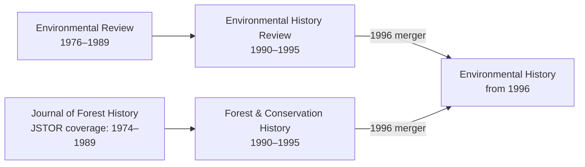

# Environmental founding correction and JSTOR harvest — revision 1.114

## Corrected venue

The field-forming journal is **Environmental Review (1976)**. ASEH’s institutional history connects its establishment to the organizing effort that produced the society in 1977. This supports a relation to the emerging US environmental-history field, while retaining earlier roots and other national traditions. [ASEH history](https://aseh.org/history).

The 1995 **Environment and History** founding edge is withdrawn. Grove explicitly described complementing existing environmental-history journals; the prior import mistook a later journal’s mission for a field-forming role. The source note also misnamed Ranajit Guha as Ramachandra Guha; this is corrected with the original record retained in the correction batch. [Founding editorial](https://www.environmentandsociety.org/sites/default/files/key_docs/Grove-1-1.pdf).

[JSTOR’s page](https://www.jstor.org/journal/envihist) lists the family; [Oxford’s archive description](https://academic.oup.com/envihistrevi/pages/About) explicitly identifies the merger and the environmental branch. [Arizona State Library](https://azlibrary.gov/starl/az-collection/periodicals) identifies the forest-title continuation. These are two branches, not a linear reading of JSTOR’s displayed list. The 2020 endpoint is platform coverage, not cessation.

Four missing title records and four title-history relationships are added. The Journal of Forest History’s precise title start remains unverified; its platform range is stored as archive coverage. JSTOR groups an earlier Forest History Newsletter run as 1957–1974; that row is preserved in staging, pending reconciliation of intervening Forest History naming. The existing Environmental History record retains its ID and metadata; its 1996 merger event is recorded in the title relationships.

The original Environment and History journal record remains in the catalogue. Its rejected edge is preserved in `venue-batches/founding-003.json` and the 1.113 snapshot. No accepted batch was rewritten.

## Reassessment of the previous additions

The corrected criterion is a journal’s constitutive role in the named field or school. A founding editorial that merely says what a new journal will publish is insufficient. The [reappraisal ledger](founding-criterion-reappraisal-v1.114.json) identifies scope/evidence issues for every 1.113 addition. Only the environmental error is resolved here; the other thirteen claims remain an explicit historical reappraisal queue. Existing edge counts must not be described as a newly verified census of founding journals.

## JSTOR bulk retrieval completed

JSTOR offers an official **Complete Title History List**, including titles outside its archive collections. [Download documentation](https://support.jstor.org/hc/en-us/articles/115007466248-JSTOR-Title-Lists).

Downloaded and parsed the entire live export on 2026-09-16:

- **5,021 rows; 4,631 distinct JSTOR title IDs.** All 390 additional rows are retained as repeated IDs/coverage variants.
- Compared all **1,628 pre-correction catalogue candidates**: **242** unique title-and-ISSN candidates, **117** title-only candidates, **11** ISSN-only candidates, **1,258** unmatched by these strict methods. Unmatched does not mean absent from JSTOR.
- The **370 matched catalogue entries** touch 358 connected reference families, containing **537 title IDs**, including **175 additional related title IDs** for review.
- **233 reported predecessor observations** have overlapping/reversed coverage; one reported reference points to an absent title ID. These are flags, not a count of proven metadata errors.

The export is useful for discovery, identifiers and title-family reconstruction, but its reference columns can serialize a family in a way that is not literal succession. For example, it reports Journal of Forest History as the predecessor of Environmental Review despite their overlapping runs. The environmental test therefore prevents automatically generating false title-change edges. Publisher/history evidence resolves the actual merger.

Saved [summary](../../data/journal-catalogue/jstor-title-history/summary.json), full raw TSV, row-preserving staging and every catalogue match under `data/journal-catalogue/jstor-title-history/`. No bulk dates or relationships have been imported into the atlas. Only the individually reviewed environmental correction above is accepted. Reproduce staging with `python3 -m scripts.stage_jstor_title_history` against the fixed 1.113 snapshot.

Next: review the 242 identifier-and-title candidates and their related title families, resolve overlapping branches with publisher/library evidence, then accept scoped title-history additions. This is a full-file harvest, not a five-journal pilot; further page-by-page discovery can address unmatched titles if needed.

## Validation

Snapshot: `drafts/historiography-1920-2000.v1.113.json`. Current catalogue: 1,632 periodical/title candidates, 803 with ISSNs, 560 starts; 798 library profiles unchanged. All existing journal nodes, dates, identifiers, bibliography and classifications are unchanged. Four new records have no subject classifications yet. All historical graph content is unchanged.

61 Python tests and the JavaScript core suite passed; zero structural errors/four unchanged warnings. Exact offline reconstruction and preservation checked. Six allowlisted public assets rebuilt and byte-checked; bulk JSTOR staging stays outside those assets. [Validation record](environmental-correction-v1.114-validation.json). No deployment or OpenAlex work.
